# Project Implementation

## PART 1 : Development
- Create AWS Account
- Create an EC2 instance
  - Region - London (eu-west-2)
  - Name - netflix-jenkins
  - AMI - Ubuntu
  - Instance type - t2.large
  - Create new key pair (if you don't have one)
    - name: netflix_key_pair, RSA,.pem
  - Network settings - Allow SSH, HTTP, HTTPS traffic
  - Configure storage - Size: 25 GiB
- Allocate Elastic IP to your Instance
- Add rules to the security group
  - 8081, Anywhere IPv4, app port
  - 8080, Anywhere IPv4, jenkins
  - 9000, Anywhere IPv4, sonarqube
- Connect to the Instance using EC2 Instance Connect
  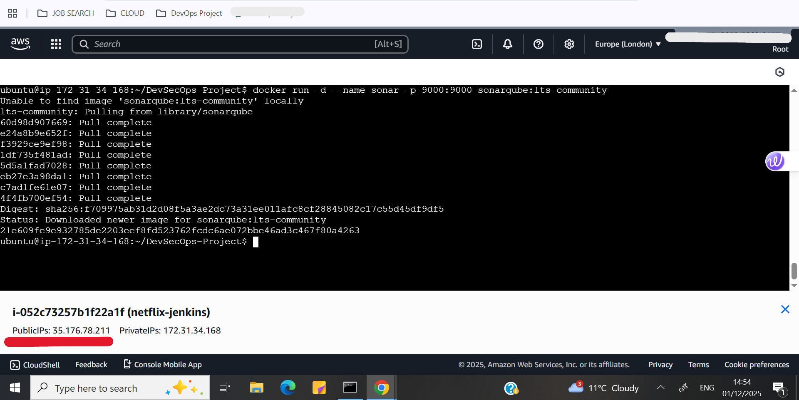
- Run ```sudo apt update -y```
- Clone your repository on the EC2 instance
- Navigate to the repository DevSecOps-Project (you'll see the Dockerfile)<br><br><br>

- In the browser, go to 'TMDB' website and create an account
- Go to your profile, create and copy the API Key<br><br><br>

- Install Docker on your EC2 instance
  - check using ```docker version```
- Run ```docker build --build-arg TMDB_V3_API_KEY=<your-api-key> -t netflix .```
  - check using ```docker images``` netflix image should be created
- Run ```docker run -d -p 8081:80 netflix```
- Copy the PublicIP of the instance, in the browser search ```<PublicIP>:8081```
  - will only open if port 8081 is open in the security group
- The Netflix clone website should be displayed successfully
  <br><br><br>

## PART 2 : Security

- Intall Sonarqube and Trivy on your instance
  - For sonarqube check using ```docker ps``` 'sonarqube:lts-community' container should be displayed
    - In your browser, search ```<PublicIP>:9000```, sonarqube login page should be seen
    - Login using 'Username: admin' & 'Password: admin'
      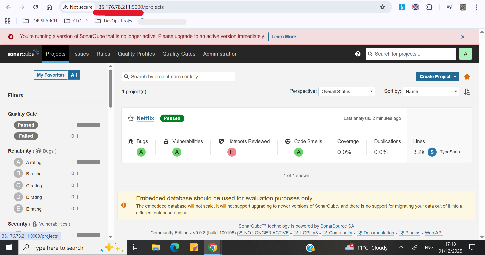
  - For Trivy check using ```trivy version```
    - trivy fs . or trivy image netflix
    - You'll get a report of vulneribilities
      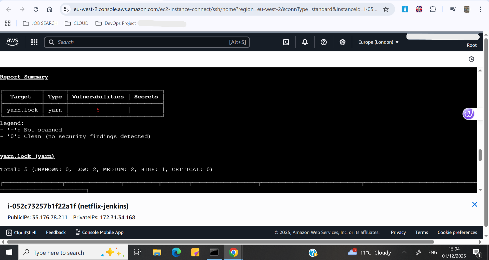 <br><br>
       <br><br><br>


## PART 3 : Operations

  - Install jenkins on your EC2 instance
    - check using ```sudo service jenkins status```
    - In your browser, search ```<PublicIP>:8080```, jenkins page will be displayed, copy the path displayed
    - In your instance, ```sudo cat <path>```, copy the password and login to jenkins

  - In Jenkins, add the following 'Plugins'
    - Eclipse Temurin Installer
    - SonarQube Scanner
    - NodeJs Plugin
      install without restart
    - OWASP Dependency check
    - Docker
    - Docker Commons
    - Docker Pipeline
    - Docker API
    - docker-build-step
    - Prometheus metrics 

  - Configure the following 'Tools'
    - JDK installation
      - Name : jdk17 (should be same as the pipeline)
    - NodeJs installation
      - Name : node16 (should be same as the pipeline)
    - SonarQube Scanner installation
      - Name : sonar-scanner (should be same as the pipeline)
    - Dependency-Check installation
      - Name : DP-Check (should be same as the pipeline)
    - Docker installation
      - Name : docker

  - Prerequsities for creating 'Credentials' and 'Systems' in jenkins :
    - Create and copy token in SonarQube
    - Create 'app password' in your gmail account and copy it
    
  - Add the following 'Credentials'
    - Add SonarQube token
      - Name : Sonar-token
    - Add Docker Username and Password
      - Name : docker
    - Add Gmail Username and Password (use the gmail account you want to get notifications in)
      - Name : mail
   
  - Configure the 'System'
    - SonarQube servers
      - Name : sonar-server
      - Server URL : https://<PublicIP>:9000
      - Server authentication token : Sonar-token
        
    - Email Notification
      - SMTP : smtp.gmail.com
      - Default user e-mail suffix : \<your-gmail>
      - Advanced :
        - Use SMTP Authentication : \<your-gmail> and \<gmail-app-password>
        - Use SSL
        - SMTP Port : 465
        - Test configuration by sending test e-mail: \<give-another-gmail>

    - Extended E-mail Notification
      - SMTP : smtp.gmail.com
      - SMTP Port : 465
      - Advanced :
        - Credentials : \<mail-credential>
        - Use SSL
      - Default content type : HTML(text/html)
      - Default Triggers : Always, Failure - Any
     
   - Delete the netflix container and image previously created
     - In your instance, ```docker ps```
     - Run ```docker stop netflix```
     - Run ```docker rm netflix```
     - check if container is deleted using ```docker ps```
     - Go to Docker Hub and delete the 'netflix' image
     - Add jenkins in the Docker group
       ```
       sudo su
       sudo usermod -aG docker jenkins
       ```
   - Create and run the pipeline in Jenkins
   - After the pipeline is run you can see the report in SonarQube, netflix image is created on Docker Hub, netflix container is running
     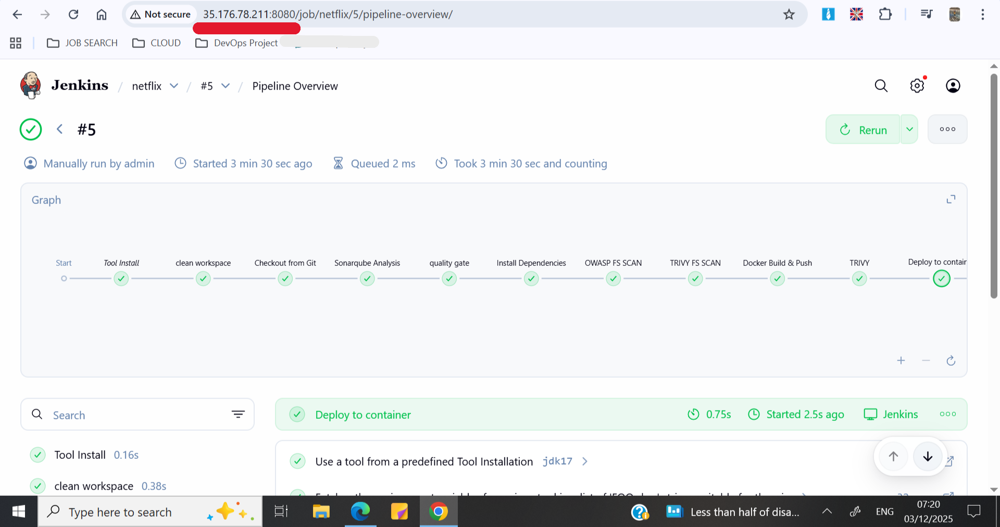 <br><br>
     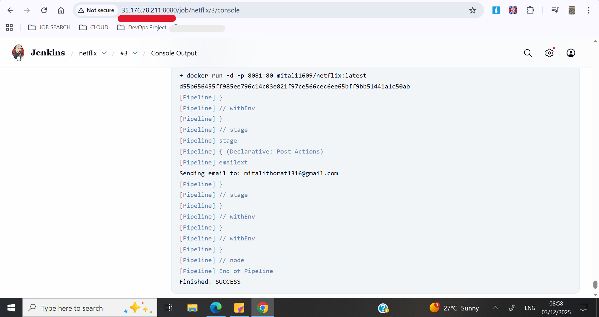 <br><br><br>

### Monitoring

- Create a new EC2 instance
  - Region - London (eu-west-2)
  - Name - Monitoring
  - AMI - Ubuntu
  - Instance type - t2.medium
  - Key pair - netflix_key_pair
  - Network settings - Allow SSH, HTTPS traffic
  - Configure storage - Size: 20 GiB
- Allocate Elastic IP to your Instance
- Add rules to the security group
  - 9090, Anywhere IPv4, prometheus
  - 9100, Anywhere IPv4, node-exporter
  - 3000, Anywhere IPv4, grafana
- Run ```sudo apt update -y``` <br><br><br>
  
- Install Prometheus on your EC2 instance
- Set ownership for directories
  - ```sudo chown -R prometheus:prometheus /etc/prometheus/ /data/```
- Create a service for prometheus
  - ```sudo nano /etc/systemd/system/prometheus.service```
  - ```
    [Unit]
    Description=Prometheus
    Wants=network-online.target
    After=network-online.target

    StartLimitIntervalSec=500
    StartLimitBurst=5

    [Service]
    User=prometheus
    Group=prometheus
    Type=simple
    Restart=on-failure
    RestartSec=5s
    ExecStart=/usr/local/bin/prometheus \
      --config.file=/etc/prometheus/prometheus.yml \
      --storage.tsdb.path=/data \
      --web.console.templates=/etc/prometheus/consoles \
      --web.console.libraries=/etc/prometheus/console_libraries \
      --web.listen-address=0.0.0.0:9090 \
      --web.enable-lifecycle

    [Install]
    WantedBy=multi-user.target
    ```

 - Enable and start Prometheus
     ```
     sudo systemctl enable prometheus
     sudo systemctl start prometheus
     ```
  - Verify Prometheus's status
    ```sudo systemctl status prometheus```
    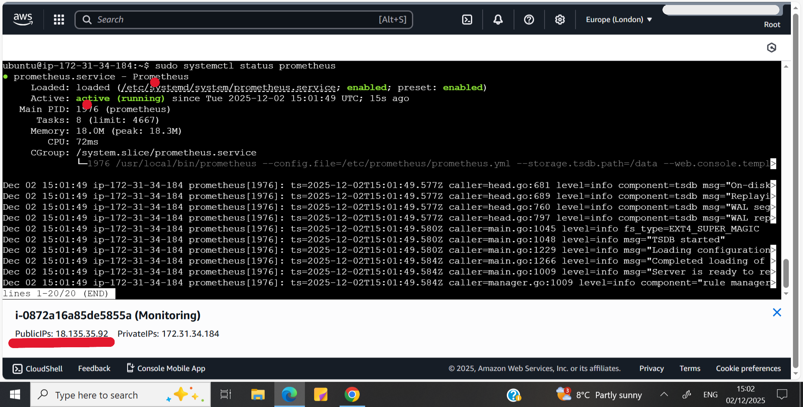 <br><br><br>
    
  - Install Node Exporter on your instance
  - Create a service for Node Exporter
    - ```sudo nano /etc/systemd/system/node_exporter.service```
    ```
    [Unit]
    Description=Node Exporter
    Wants=network-online.target
    After=network-online.target
    
    StartLimitIntervalSec=500
    StartLimitBurst=5
    
    [Service]
    User=node_exporter
    Group=node_exporter
    Type=simple
    Restart=on-failure
    RestartSec=5s
    ExecStart=/usr/local/bin/node_exporter --collector.logind
    
    [Install]
    WantedBy=multi-user.target
    ```

  - Enable and start Node Exporter
    ```
    sudo systemctl enable node_exporter
    sudo systemctl start node_exporter
    ```
  - Verify Node Exporter's status
    ```sudo systemctl status node_exporter```
    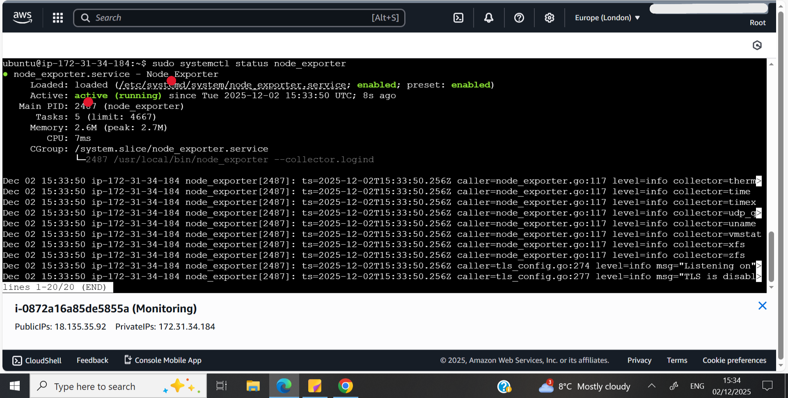 <br><br><br>

  - Add jobs to the 'prometheus.yml' file
    - Navigate to ```/etc/prometheus/```
    - Run ``` cat prometheus.yml``` and add jobs in the file
      ```
      - job_name: "node_exporter"
        static_configs:
          - targets: ["<PublicIP>:9100"]

        - job_name: "jenkins"
          metrics_path: "/prometheus"
          static_configs:
            - targets: ["<PublicIP>:8080"]
      
        - job_name: "K8s"
          metrics_path: "/metrics"
          static_configs:
            - targets: ["<PublicIP-of-node>:9100"]
      ```
    - Check syntax using
      ```promtool check config /etc/prometheus/prometheus.yml```

    - Reload Prometheus ```curl -X POST http://localhost:9090/-/reload```
    - In the browser search ```<PublicIP-of-Monitoring-intance>:9090``` go to 'Status' -> 'Targets', the prometheus and node exporter metric should be displayed
      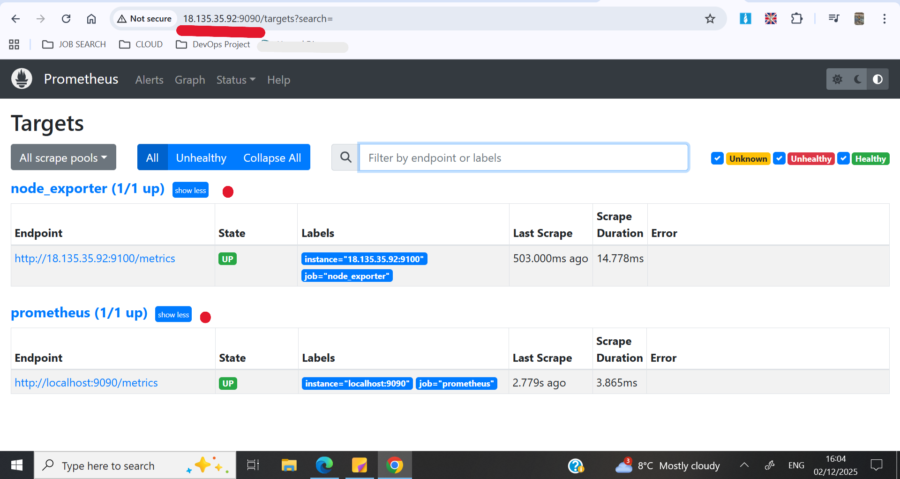 <br><br><br>
      
    - Install Grafana on your EC2 instance
    - Enable and Start Grafana Service
      ```
      sudo systemctl enable grafana-server
      sudo systemctl start grafana-server
      ```
    - Check Grafana Status ```sudo systemctl status grafana-server```
      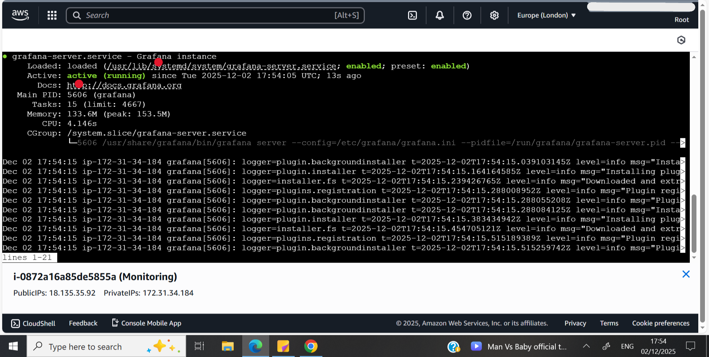<br><br><br>
      
    - In the browser search ```<PublicIP-of-Monitoring-intance>:3000``` Grafana login page should be displayed
    - Login using 'Username: admin' & 'Password: admin'
    - Add Prometheus as a Data source
    - Import node exporter dashboard - 1860
    - Dashboard will be displayed
      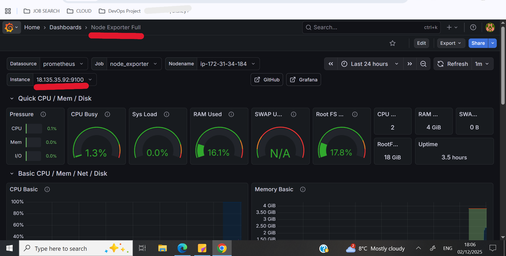<br><br><br>
    - Import Jenkins dashboard - 9964
    - Dashboard will be displayed
      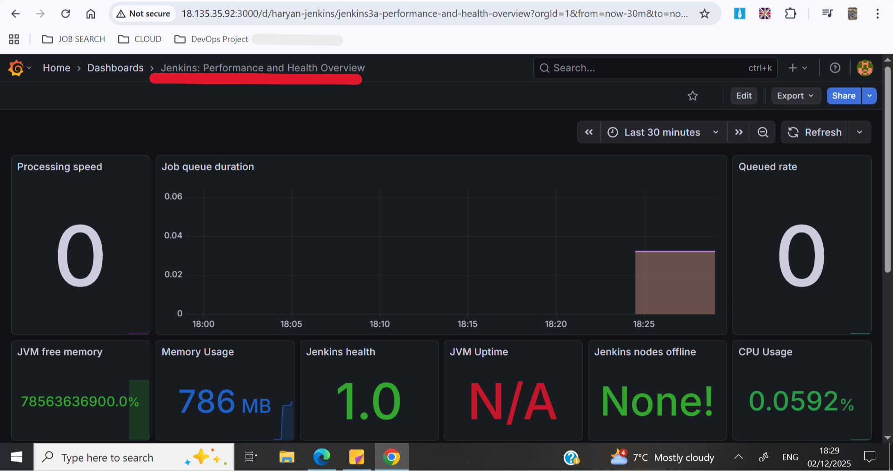<br><br><br>
   
  ## Kubernetes

- Create EKS Cluster
  - Name : Netflix
  - Cluster service role : Create recommended role
    - If creating your own role must have these poilicies :
    - AmazonEKSBlockStoragePolicy
    - AmazonEKSClusterPolicy
    - AmazonEKSComputePolicy
    - AmazonEKSLoadBalancingPolicy
    - AmazonEKSNetworkingPolicy
  - Subnet : Atleast two
    - All subnets used should have the following tags
      - Key : kubernetes.io/role/elb , Value : 1
      - Key : kubernetes.io/cluster/Netflix , Value : shared
  - Cluster endpoint access : Public and Private
  - Add Ons:
    - Amazon EKS Pod Identity Agent
    - Metrics Server
    - Amazon VPC CNI
    - kube-proxy
    - CoreDNS
  - Everything else is default settings
  - Will be 'Active' in 15-20 minutes
 
- Create Node group in the EKS Cluster
  - Name : Node group
  - Node IAM role : Create recommended role
    - Must have following policies :
    - AmazonEC2ContainerRegistryPullOnly
    - AmazonEKSWorkerNodeMinimalPolicy
  - Node group scalling configuration : 
    - Desired size : 1
    - Minimum size : 1
    - Maximum size : 1
  - Everything else is default settings
 
 - On your machine, set context to start using EKS Cluster
   ```aws eks update-kubeconfig --name Netflix --region <your-region>```
 - Install Kubectl
 - Install Helm
 - Install Argocd
 - Expose argocd-server
 - Install Node Exporter

 - Login Argocd using 'Username: admin' & 'Password: admin'
 - Add Repository in argocd
 - Create Application in argocd
 - Amazon Elastic Kubernetes Service\Clusters\Netflix\nodes
 - In the EC2 instance attached to the node, edit the security group
   - 30007, Anywhere IPv4, app nodeport
   - 9100, Anywhere IPv4, nodeexporter
- In the browser search \<PublicIP>:30007, Netflix page should be displayed 


